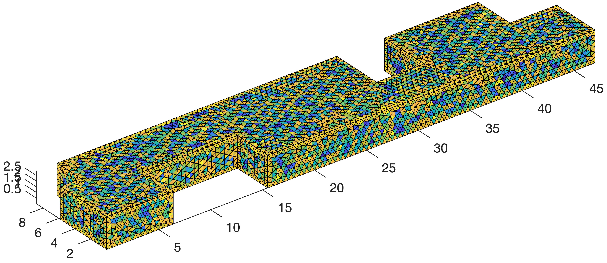

# EDG_Acoustics_matlab
Discontinuous Galerkin Acoustics Simulator

## Description
This repository contains the developements/MATLAB codes programmed by Dr. Huiqing Wang during his PhD study at Building Acoustics group of Department of the Built Environment, Eindhoven University of Technology.  All the derivations and mathematical details can be found in Huiqing's PhD thesis ([link to PhD thesis](https://research.tue.nl/nl/publications/room-acoustic-modeling-with-the-time-domain-discontinuous-galerki)).

The codes are for education and research purposes. In case there is any question, please contact Huiqing Wang (h.wang6@tue.nl) or Prof. Maarten Hornikx (m.c.j.hornikx@tue.nl).

The main code is main_edg_A.m, which performs a 3D room acoustic time-domain simulation of a real open plan office. The first few lines are related to parameter setting (with explanatory comments).

Folder DG_source contains the necessary source codes from the developers and other open-source codes made by Hesthaven et. al ([github repository](https://github.com/tcew/nodal-dg)).This folder should be added to the MATLAB path (done automatically in mainEAS.m)
